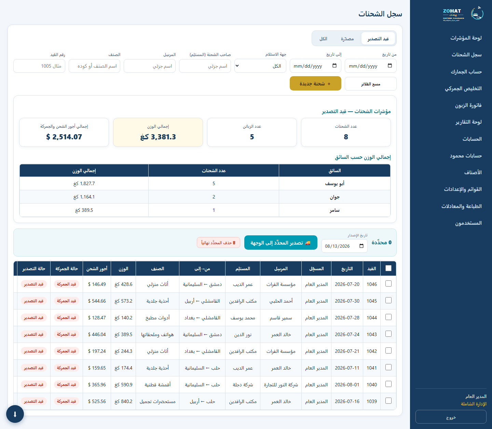
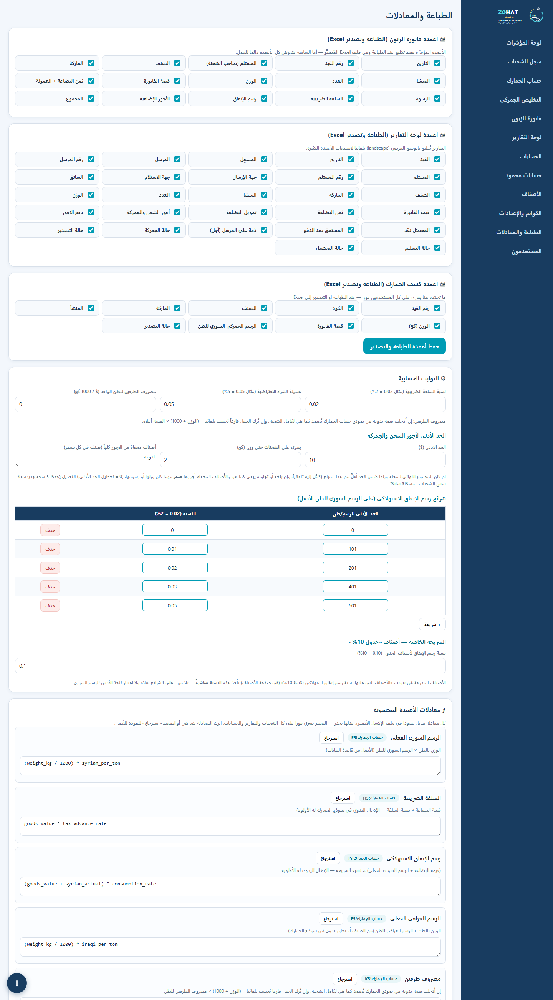
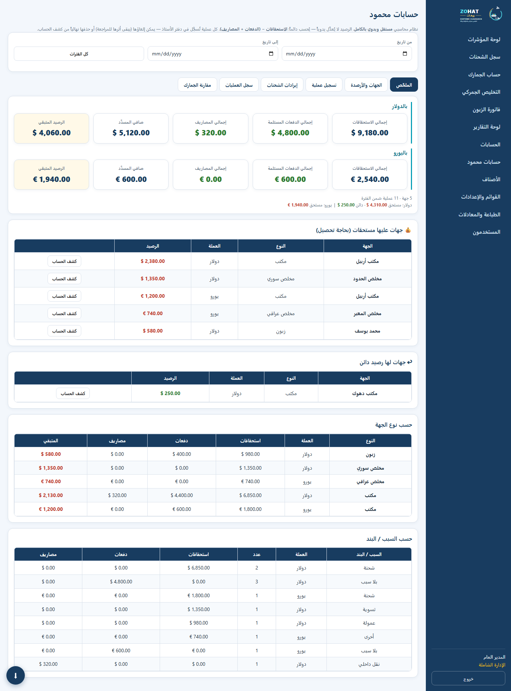
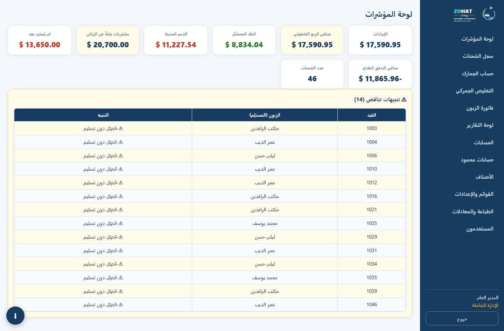
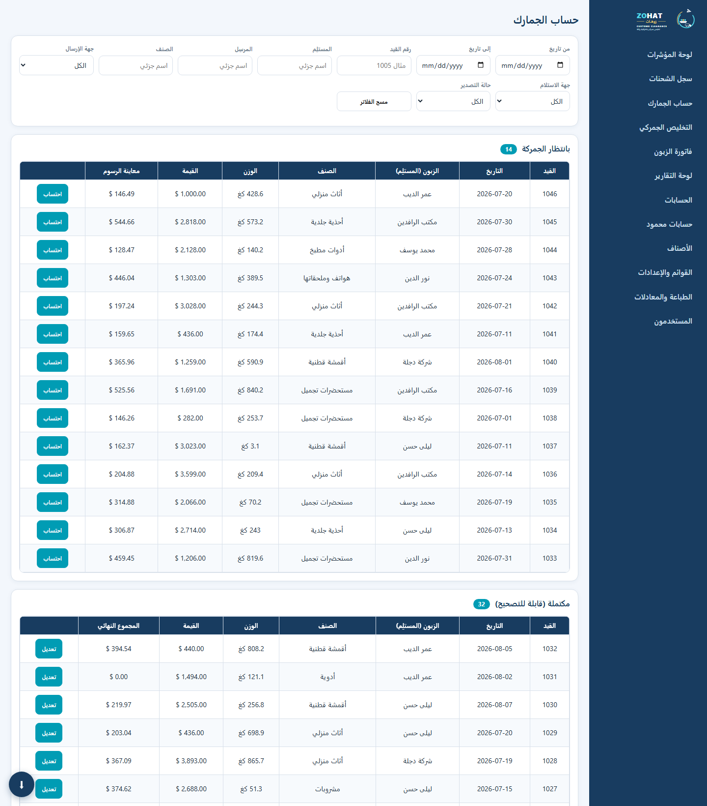
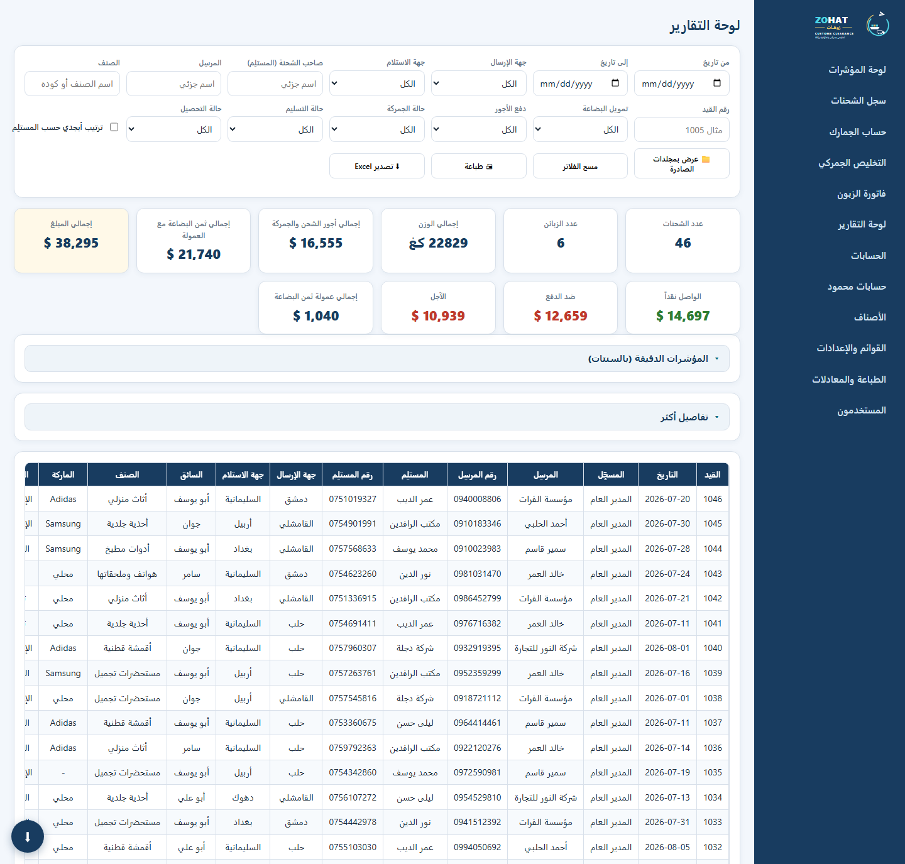
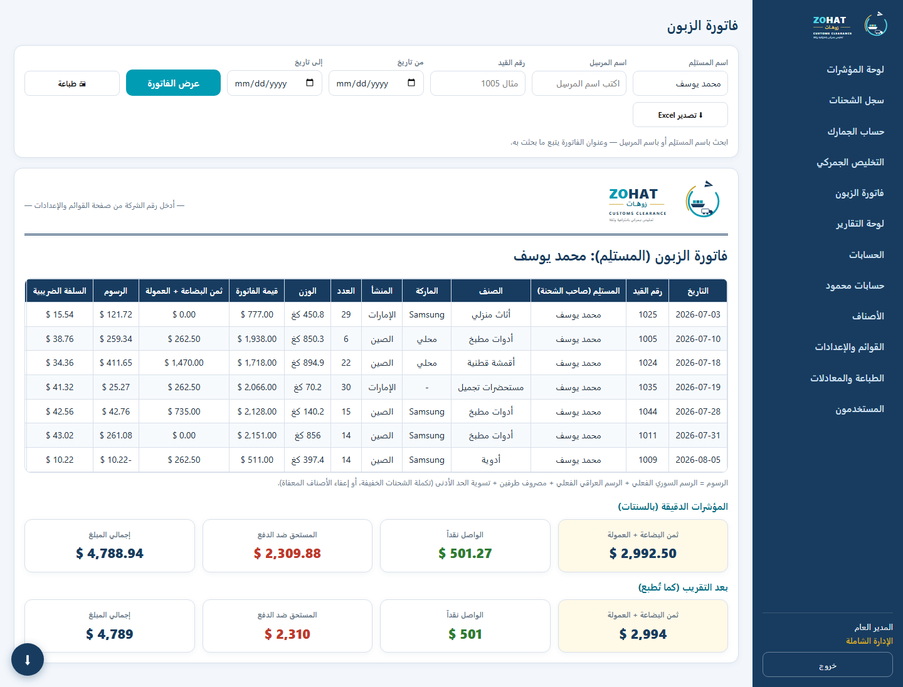
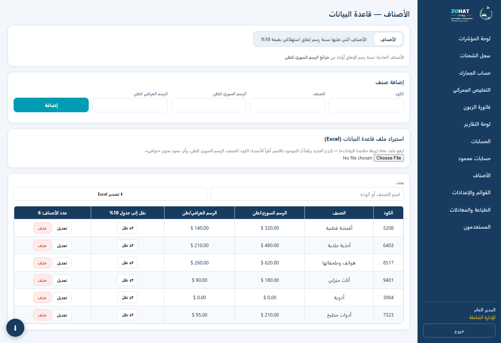

# ZOHAT — Shipping & Customs Clearance System

> 🇸🇦 **العربية:** [README.ar.md](README.ar.md) · 🏛 **Architecture:** [ARCHITECTURE.md](ARCHITECTURE.md)

A production system that replaced a fragile multi-sheet Excel workbook used to run a
cross-border shipping and customs-clearance business between Syria and Iraq.

It is in daily use by six different roles across multiple branch offices, handling
customs duty calculation, customer invoicing, inter-office receivables, and a
double-entry-style ledger — in Arabic, right-to-left, and usable offline.

**Stack:** FastAPI · SQLModel · SQLite/PostgreSQL · vanilla JS PWA (no framework) · pywebview desktop build



<sub>Shipments register — role-scoped KPIs, per-driver weight breakdown, live filters and bulk
operations. **All data shown throughout this README is fictional**, generated by a seeding
script into a throwaway database.</sub>

---

## The problem

The business ran on one Excel file. It broke the way spreadsheets always break:

- **No concurrency** — one person edited at a time, and copies diverged.
- **No access control** — every branch could see and alter every other branch's data.
- **Silent retroactive damage** — changing a duty rate or a formula rewrote *history*,
  so last month's invoices no longer matched what the customer had already paid.
- **No audit trail** — a deleted row was simply gone.

The third point is the one that actually costs money, and it drove most of the design below.

## Engineering decisions worth reading

### 1. Formula versioning — edits never rewrite history

Business rules (duty tiers, tax advance, commission, minimum fees) are **user-editable
formulas**, not hardcoded logic. The obvious implementation recomputes every record from
the current rules — which silently changes shipments that were invoiced months ago.

Instead, every configuration change is saved as an immutable **version**, and each shipment
pins the `calc_version_id` it was created under. A shipment is always recomputed with *its
own* rules.

```python
# calc.py — each shipment resolves the config it was registered with
d.update(compute(sh, syr, irq, resolve(sh.calc_version_id), sh.special_consumption))
```

The same freezing principle was applied to every input that could drift: per-item duty
rates and consumption-tier membership are **snapshotted onto the shipment** at
registration, so editing an item's rate today affects only future shipments.

### 2. A safe evaluator for user-written formulas

Letting users write arithmetic that the server executes is a remote-code-execution hole if
done naively. Formulas are parsed to an AST and walked against an explicit allowlist —
no attribute access, no calls except `min/max/round/abs`, no names outside the supplied
variables.

```python
_ALLOWED_NODES = (ast.Expression, ast.BinOp, ast.UnaryOp, ast.Constant, ast.Name, ast.Load,
                  ast.IfExp, ast.Compare, ast.BoolOp, ...)
```

A malformed or malicious formula falls back to the shipped default rather than crashing
the calculation for every shipment.

### 3. Authorization enforced at the API, not the UI

Six roles (admin, supervisor, accountant, collector, broker, branch office) each get a
per-field allowlist plus row-level visibility scoping. Hiding a button is not access
control — the server re-checks ownership on every mutation.

While building the collector role I found that filtering list endpoints was **not enough**:
a user could still mutate another city's record by ID. That IDOR is closed explicitly:

```python
def _assert_collector_city(user, sh):
    if user.role == ROLE_COLLECTOR and user.branch and sh.from_city != user.branch:
        raise HTTPException(403, "...")   # عزل لا يكفي إخفاؤه في القوائم
```



<sub>The formula editor. Each rule shows its original spreadsheet cell reference, its
documentation, the live expression and a reset-to-default button. Saving writes a new
version — existing shipments keep the version they were registered under.</sub>

### 4. A ledger where balances are never stored

The accounting module keeps no balance column. Every balance is derived:

```
balance = Σ charges − (Σ payments + Σ expenses)
```

Entries are **voided, never deleted**, keeping the audit trail intact, and each void/edit
is written to a separate audit table. Balances are computed **per currency** (USD/EUR)
with independent running totals, so a euro payment can never offset a dollar debt.

When a shipment's payment terms change, the ledger charge it produced is reconciled
automatically — the stale entry is voided with a reason and a corrected one issued,
rather than being silently overwritten.



<sub>Ledger summary. USD and EUR are computed and displayed as independent books —
they never merge into a single total anywhere. Note the party carrying a *credit*
balance, which the system treats as valid rather than as an error.</sub>

### 5. Operational concerns treated as features

- **Backups**: consistent SQLite snapshots via `VACUUM INTO` (not a naive file copy, which
  can capture a torn database mid-write), pushed to Telegram on a schedule that survives
  restarts by persisting its last-run slot.
- **Restore**: upload path gated by header check → `PRAGMA integrity_check` → required-table
  check → automatic pre-restore safety copy → atomic swap.
- **Offline**: service worker with network-first for the shell so updates land immediately,
  cache fallback when the connection drops (relevant for the target region's connectivity).

---

## Features

| Area | What it does |
|---|---|
| Shipments | Registration, per-branch isolation, bulk export/revert/delete, folder browsing by year → month → day |
| Customs | Separate calculation step with live server-side preview; manual overrides for every derived figure |
| Invoicing | Per-customer invoices, print-optimised layouts, admin-configurable print columns |
| Reports | Multi-criteria filtering, KPI cards, per-driver weight breakdowns, Excel export |
| Accounting | Company-wide summary plus an independent manual ledger with multi-currency support |
| Admin | Editable formulas, dropdown lists, roles/users, print configuration, backup & restore |

## More screens

| | |
|---|---|
|  **Dashboard** — company-wide KPIs and consistency alerts |  **Customs** — pending vs. completed queues with filters |
|  **Reports** — multi-criteria filtering, rounded vs. precise KPI modes |  **Customer invoice** — print-ready, admin-selectable columns |
|  **Items** — duty rates, the 10% consumption-tier table, Excel import/export | |

## Running it

```bash
cd backend
python -m venv .venv && .venv/Scripts/activate   # Linux/macOS: source .venv/bin/activate
pip install -r requirements.txt
uvicorn app.main:app --reload
```

Open `http://127.0.0.1:8000` — FastAPI serves the frontend, so there is no second server.
Sign in as `admin` with the password from the `ADMIN_PASSWORD` environment variable.

Deployment notes (Railway, persistent volume, Telegram backups, env vars) are in
[README.ar.md](README.ar.md).

> **Note:** this repository intentionally ships **no production URL and no credentials**.
> The desktop client reads its server address from `ZOHAT_URL`, a `zohat_url.txt` file, or
> a build-time variable.

## Repository layout

```
backend/app/
  calc.py       formula engine, safe evaluator, version freezing
  models.py     SQLModel tables
  core/         config, database + migrations, JWT auth & RBAC
  routers/      auth · shipments · accounting · admin · settings · mahmoud · backup
frontend/       vanilla JS PWA (RTL), service worker, manifest
desktop/        pywebview + PyInstaller wrapper for Windows
```

## License

[MIT](LICENSE)
